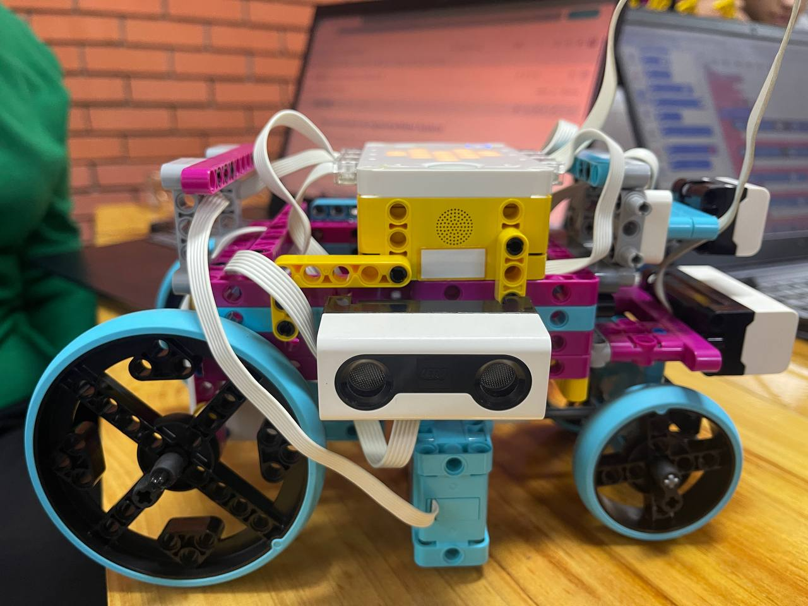
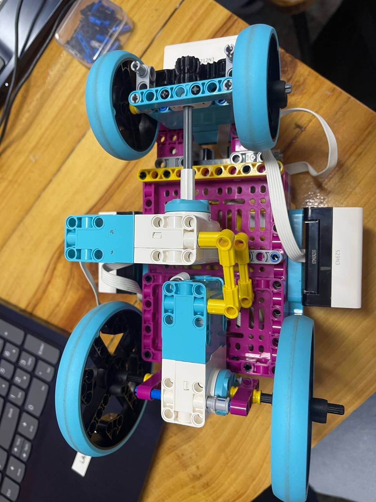
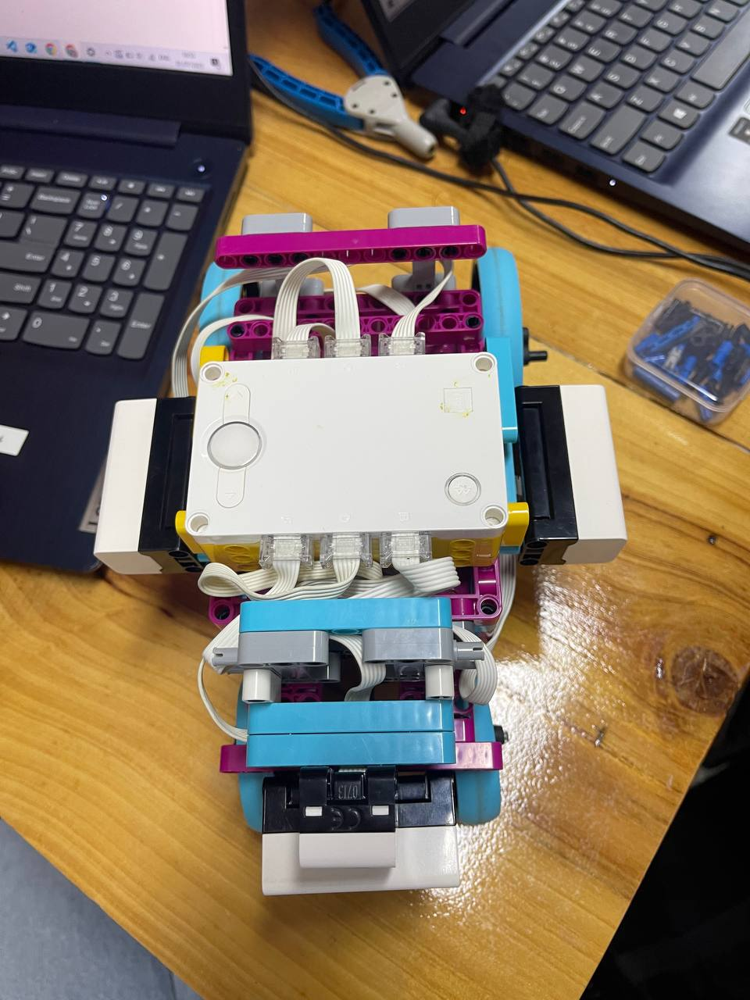
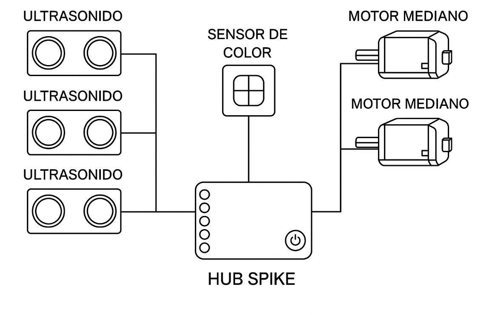

Documentacion de ingenieria/Mater Systems
====

Este repositorio contiene todos los recursos requeridos para construir a "Mia", el robot autonomo creado por el equipo "Mater Systems" que participara en la categoria Futuros ingenieros en la WRO en la temporada 2025

## Contenido

* `t-photos` 

* `v-photos`

  Izquierda

Derecha 

Frente

Detras

Abajo

Arriba

  
* MECANICA
  

-3 ULTRASONIDOS
* MIA tiene un sensor de ultrasonido que le permite medir distancias y detectar obstaculos en su entorno, ayudandole a moverse de manera segura y eficiente, ajustando su direccion segun el espacio disponible.
  
-SENSOR DE COLOR
* MIA tiene un sensor de color para detectar y distinguir diferentes colores en su entorno. Esto le permite realizar tareas como identificar objetos o hasta seguir lineas de colores especificos.
  
-2 MOTORES MEDIANOS DE SPIKE
* MIA contiene 2 motores con diferentes funciones.
* 1 para avanzar y el otro para direccionar.

* `Diagrama Esquematico` 

                                                                                                                                        - Introducción al Código del Software de Control

El software de control del vehículo consta de varios módulos funcionales, que corresponden directamente a los componentes electromecánicos conectados al Hub SPIKE. Este hub actúa como el controlador central, coordinando la lectura de sensores y el accionamiento de los motores.                                                                                                                                            

## Sobre MIA

Módulos del Código
 1. Módulo de Sensores de Ultrasonido:
 • Se encarga de leer la distancia de obstáculos usando los tres sensores ultrasónicos.
 • Cada sensor se ubica estratégicamente en el vehículo (frontal y laterales).
 • La información se utiliza para evitar colisiones y ajustar la dirección del vehículo.
 2. Módulo del Sensor de Color:
 • Detecta bloques de colores.
 . Sirve para  reaccionar a señales visuales (como detenerse ante un color específico).
 3. Módulo de Control de Motores Medianos:
 • Recibe las decisiones de los módulos de sensores y ejecuta los movimientos correspondientes.
 • Controla la velocidad y dirección de los motores para avanzar, girar o detenerse.
 4. Módulo de Lógica de Decisión (Control Central):
 • Integra la información de todos los sensores.
 • Define la lógica de navegación: por ejemplo, “si el sensor frontal detecta un obstáculo y el lateral derecho está libre, gira a la derecha”.
 • Coordina los motores según la decisión tomada.

Proceso de Compilación y Carga del Código
 1. Lenguaje y Plataforma:
 • El código se desarrolla usando Word Blocks o Python en la app oficial de LEGO Education SPIKE.
 • También puede usarse la app SPIKE Legacy o SPIKE Prime según la versión del hub.
 2. Conexión del Hub:
 • Conectar el Hub SPIKE vía Bluetooth o cable USB al ordenador o tablet.
 3. Carga del Código:
 • Una vez finalizado y probado el código, se presiona el botón de descarga en la interfaz del software.
 • El código se transfiere y almacena directamente en la memoria del hub.
 4. Ejecución:
 • El Hub ejecuta el programa de manera autónoma tras iniciarlo desde el botón principal o desde la app.
